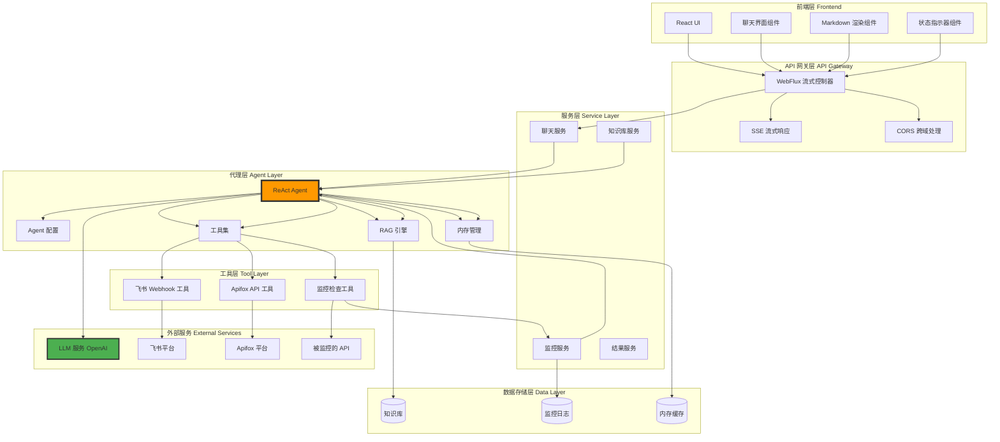
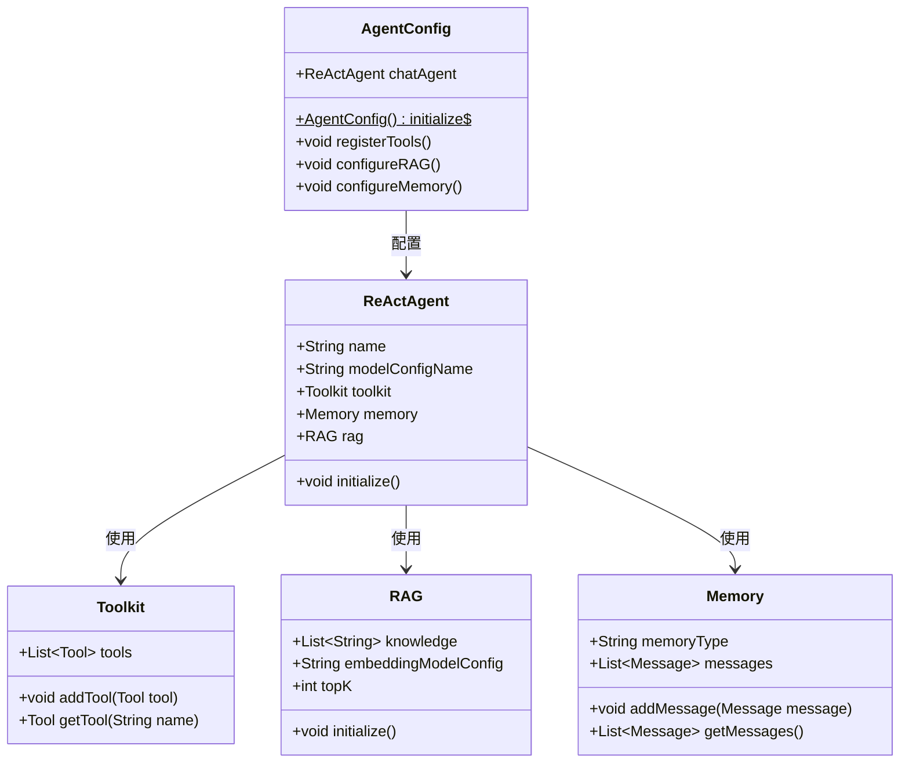
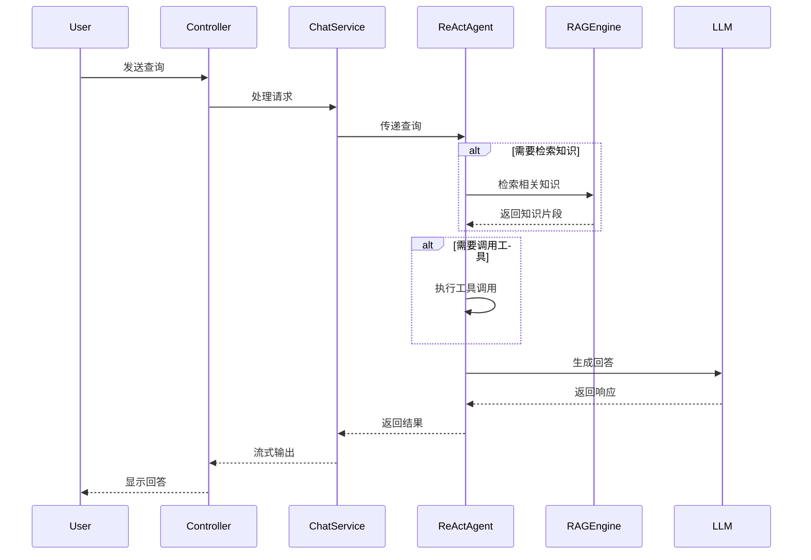
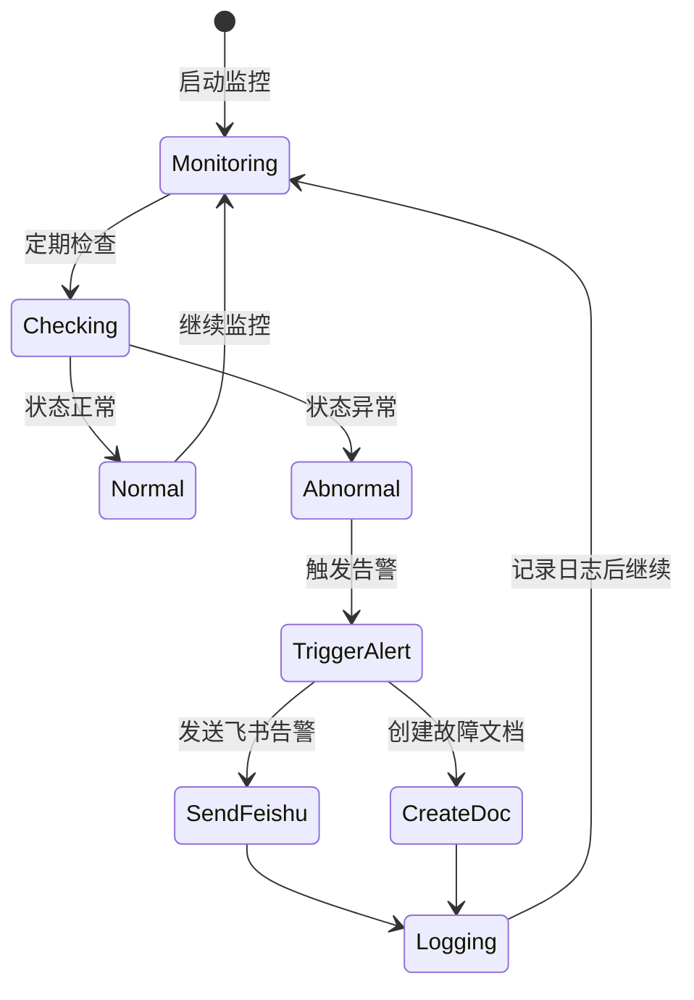
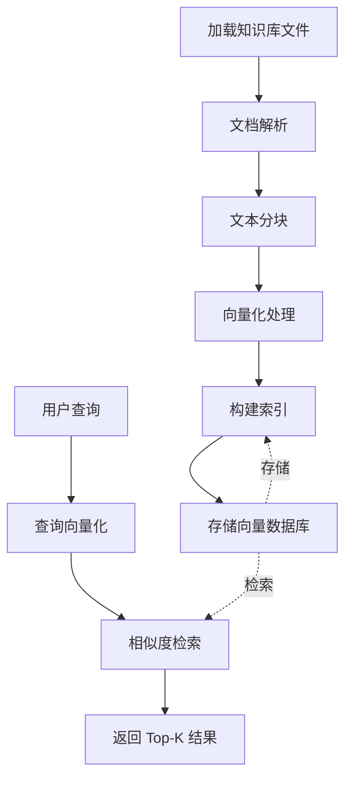
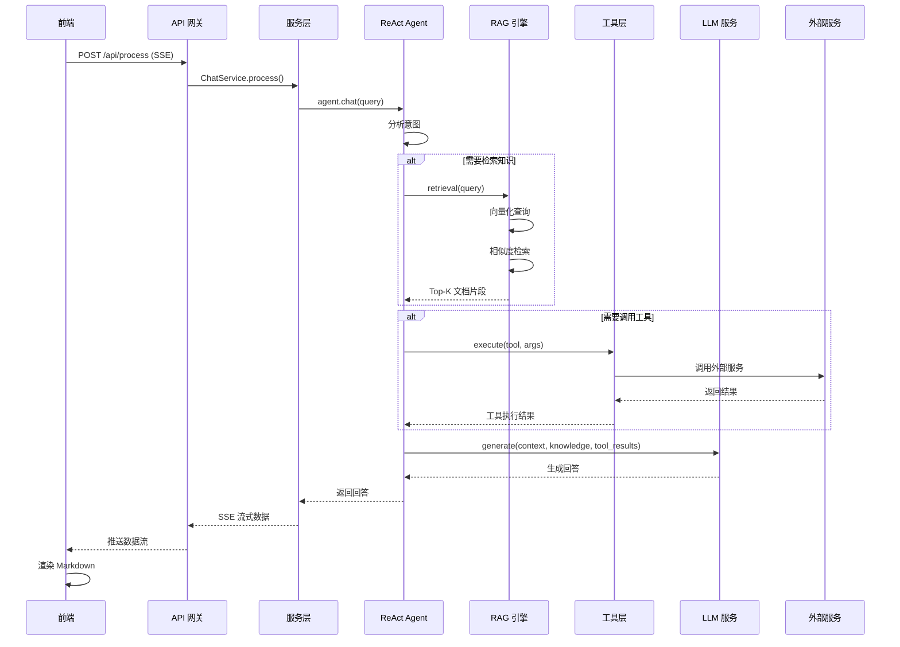
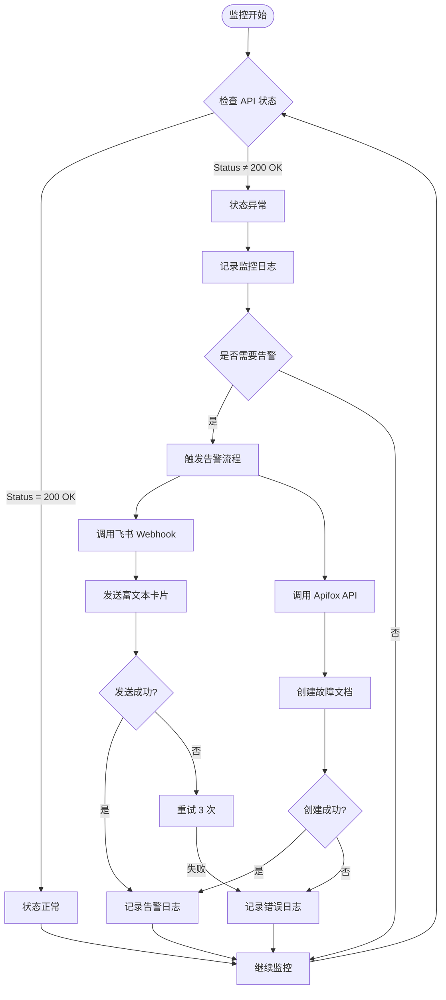

# 架构文档

## 目录

- [系统概述](#系统概述)
- [系统架构](#系统架构)
- [模块设计](#模块设计)
- [数据流](#数据流)
- [技术选型](#技术选型)
- [扩展性设计](#扩展性设计)

---

## 系统概述

智能客服监控系统是一个基于 AgentScope 框架的全栈应用，采用前后端分离架构，结合 RAG（检索增强生成）技术和 DevOps 监控能力，提供智能问答、实时监控和自动告警功能。

### 核心特性

1. **Agent 驱动** - 使用 ReAct Agent 进行推理和行动
2. **响应式设计** - 基于 Spring WebFlux 的异步非阻塞架构
3. **知识增强** - Agentic RAG 模式实现自主知识检索
4. **流式交互** - SSE 实时流式输出提升用户体验
5. **多工具集成** - 无缝集成飞书、Apifox 等外部服务

---

## 系统架构

### 整体架构图



### 分层架构说明

#### 1. 前端层 (Frontend Layer)

**职责**: 用户交互界面和响应渲染

- **React UI**: 基于 React 18 和 TypeScript 构建的单页应用
- **聊天界面组件**: 处理用户输入和显示对话历史
- **Markdown 渲染组件**: 将 Agent 返回的 Markdown 格式内容渲染为富文本
- **状态指示器组件**: 实时显示系统健康状态

**技术特点**:
- 使用 Ant Design 提供企业级 UI 组件
- 通过 `react-markdown` 和 `remark-gfm` 支持 GitHub Flavored Markdown
- 使用 EventSource API 接收 SSE 流式响应

#### 2. API 网关层 (API Gateway Layer)

**职责**: 请求路由和流式响应处理

- **WebFlux 流式控制器**: 处理所有 HTTP 请求
- **SSE 流式响应**: 通过 Server-Sent Events 实现实时数据推送
- **CORS 跨域处理**: 配置允许前端访问后端 API

**技术特点**:
- 基于 Spring WebFlux 实现非阻塞 I/O
- 使用 `Flux<DataBuffer>` 处理流式数据
- 配置 CORS 允许所有来源（生产环境建议限制）

#### 3. 代理层 (Agent Layer)

**职责**: 智能推理和决策

- **ReAct Agent**: 推理-行动模式的智能代理
- **RAG 引擎**: Agentic 模式的知识检索
- **内存管理**: InMemory Memory 存储对话上下文
- **工具集**: 注册和调用各类工具

**工作流程**:
```
1. 接收用户输入
2. 分析意图，决定是否需要检索知识
3. 执行工具调用（监控、告警等）
4. 生成最终回答
5. 返回给用户
```

#### 4. 服务层 (Service Layer)

**职责**: 业务逻辑处理

- **聊天服务**: 处理用户查询与 Agent 交互
- **监控服务**: 实时监控 API 状态
- **知识库服务**: 管理知识库文档和向量索引
- **结果服务**: 处理结果记录和持久化

#### 5. 工具层 (Tool Layer)

**职责**: 外部服务集成

- **飞书 Webhook 工具**: 发送告警到飞书
- **Apifox API 工具**: 创建故障记录文档
- **监控检查工具**: 检查 API 状态和健康度

#### 6. 数据存储层 (Data Layer)

**职责**: 数据持久化和缓存

- **知识库**: 存储 Markdown/TXT 文档
- **监控日志**: 记录 API 状态变化
- **内存缓存**: 缓存对话上下文和热点数据

---

## 模块设计

### Agent 配置模块

**文件**: `AgentConfig.java`



**核心方法**:

| 方法 | 说明 |
|------|------|
| `initialize()` | 初始化 Agent，配置 LLM、工具、记忆和 RAG |
| `registerTools()` | 注册所有可用的工具 |
| `configureRAG()` | 配置 RAG 知识库和 Embedding 模型 |
| `configureMemory()` | 配置对话记忆存储 |

### 服务模块设计

#### ChatService



**主要功能**:
1. 构建对话上下文
2. 判断是否需要检索知识库
3. 触发工具调用
4. 处理流式响应

#### MonitorService



**监控流程**:
1. 定期检查目标 API 状态
2. 判断是否需要告警（status != 200 OK）
3. 调用飞书 Webhook 发送告警
4. 调用 Apifox API 创建故障文档
5. 记录监控日志

#### KnowledgeBaseService



**RAG 工作流程**:
1. **文档加载**: 从文件系统加载 Markdown/TXT 文档
2. **分块处理**: 按照指定大小和重叠度将文档分块
3. **向量化**: 使用 Embedding 模型将文本块转换为向量
4. **索引构建**: 构建向量索引以便快速检索
5. **查询检索**: 将用户查询向量化，检索相似文档片段
6. **结果返回**: 返回 Top-K 个最相关的知识片段

### 工具模块设计

#### FeishuWebhookTool

**功能**: 发送富文本卡片告警到飞书

**参数**:
| 参数 | 类型 | 说明 |
|------|------|------|
| `timestamp` | String | 告警时间戳 |
| `status` | String | API 状态码 |
| `latency` | String | 响应延迟 |
| `message` | String | 告警消息 |

**返回**: 发送结果（成功/失败）

#### ApifoxApiTool

**功能**: 自动创建故障记录文档到 Apifox

**参数**:
| 参数 | 类型 | 说明 |
|------|------|------|
| `title` | String | 文档标题 |
| `content` | String | Markdown 格式内容 |

**返回**: 创建的文档 URL

#### MonitorCheckTool

**功能**: 检查系统状态和健康度

**方法**:
- `check_monitor_status()`: 检查系统状态
- `get_monitor_logs()`: 获取监控日志
- `is_api_healthy()`: 检查 API 健康状况

---

## 数据流

### 用户查询流程



### 告警触发流程



---

## 技术选型

### 后端技术栈

| 技术 | 版本 | 选型理由 |
|------|------|----------|
| Spring Boot | 4.0.1 | 企业级 Java 应用框架，生态丰富 |
| Spring WebFlux | 4.0.1 | 响应式编程，非阻塞 I/O，高并发性能 |
| AgentScope | 1.0.5 | 官方 Agent 框架，支持 ReAct 和 RAG |
| Java | 17 | LTS 版本，性能稳定，特性丰富 |
| OkHttp4 | 4.x | 高效的 HTTP 客户端，支持异步 |
| Lombok | 1.18.x | 简化 Java 代码，减少样板代码 |

### 前端技术栈

| 技术 | 版本 | 选型理由 |
|------|------|----------|
| React | 18.3.1 | 组件化开发，生态成熟 |
| TypeScript | 5.7.2 | 类型安全，提升代码质量 |
| Vite | 6.0.7 | 快速构建，HMR 体验好 |
| Ant Design | 5.12.0 | 企业级 UI 组件库，设计美观 |
| react-markdown | 9.x | Markdown 渲染，支持 GFM |

### AI 相关技术

| 技术 | 说明 |
|------|------|
| ReAct Agent | 推理-行动模式，能够进行多步推理和工具调用 |
| Agentic RAG | Agent 自主决定是否检索知识库，灵活性高 |
| OpenAI API | 提供强大的 LLM 能力 |
| Embedding | 将文本转换为向量，用于相似度检索 |

---

## 扩展性设计

### 水平扩展

- **无状态设计**: Agent 状态存储在内存中，可横向扩展服务实例
- **负载均衡**: 通过 Nginx 或 Kubernetes Service 进行负载均衡
- **分布式会话**: 可将内存存储迁移到 Redis，实现分布式会话

### 垂直扩展

- **配置化**: 通过配置文件调整资源使用（线程池、缓存大小等）
- **组件解耦**: 各模块低耦合，可独立优化和扩展

### 功能扩展

#### 添加新工具

```java
// 1. 创建新工具类
public class MyCustomTool {
    @Tool(name = "my_tool")
    public String execute(String param) {
        // 工具逻辑
        return "result";
    }
}

// 2. 在 AgentConfig 中注册
@Bean
public Toolkit toolkit() {
    Toolkit toolkit = new Toolkit();
    toolkit.add(new MyCustomTool());
    return toolkit;
}
```

#### 集成新 LLM

在 `application.properties` 中配置：

```properties
agentscope.llm.model-name=your-new-model
agentscope.llm.base-url=your-llm-endpoint
```

#### 添加新知识库

1. 将文档放入 `backend/src/main/resources/knowledge/` 目录
2. 重启服务，知识库会自动加载

### 性能优化

- **缓存策略**: 对热点数据和知识检索结果进行缓存
- **异步处理**: 使用 Spring WebFlux 的异步非阻塞特性
- **连接池**: 配置 OkHttp 连接池提升 HTTP 客户端性能
- **批量处理**: 监控日志可批量写入，减少 I/O 开销

---

## 安全性设计

### API 安全

- **CORS 配置**: 生产环境建议限制允许的来源
- **输入验证**: 对用户输入进行验证和清理
- **速率限制**: 可集成 Redis + Lua 实现令牌桶限流

### 数据安全

- **敏感信息**: API Key 等敏感信息通过环境变量传递
- **日志脱敏**: 监控日志中的敏感信息需脱敏处理
- **传输加密**: 使用 HTTPS 加密数据传输

### LLM 安全

- **提示词注入**: 对用户输入进行转义和过滤
- **内容审核**: 对 LLM 输出进行审核，过滤不当内容
- **访问控制**: 通过 API Key 控制 LLM 访问权限

---

## 监控和日志

### 应用监控

- **健康检查**: `/api/health` 端点提供服务健康状态
- **状态监控**: `/api/monitor/status` 获取系统状态
- **性能指标**: 可集成 Micrometer 暴露 Prometheus 指标

### 日志记录

- **应用日志**: 使用 SLF4J + Logback 记录应用日志
- **监控日志**: MonitorService 记录 API 状态变化
- **工具调用日志**: Hook 记录所有工具调用情况

### 告警机制

- **飞书告警**: 实时告警通知
- **日志告警**: 对关键错误日志进行告警
- **指标告警**: 对性能指标阈值进行告警

---

## 总结

智能客服监控系统采用现代化的微服务架构，结合 AgentScope 框架的强大 AI 能力，实现了智能问答、实时监控和自动告警的完整闭环。系统具有良好的扩展性、可维护性和安全性，能够满足企业级应用的需求。

### 关键优势

1. **智能化**: 基于 ReAct Agent 的多步推理能力
2. **实时性**: SSE 流式响应，实时监控告警
3. **扩展性**: 模块化设计，易于扩展功能
4. **易用性**: 清晰的架构和完善的文档
